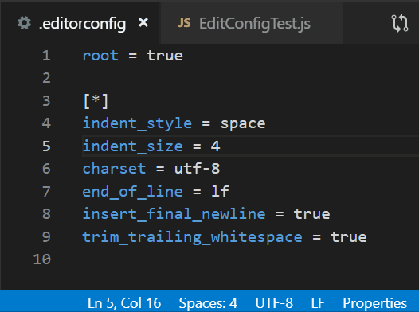
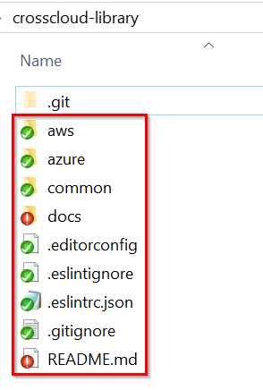
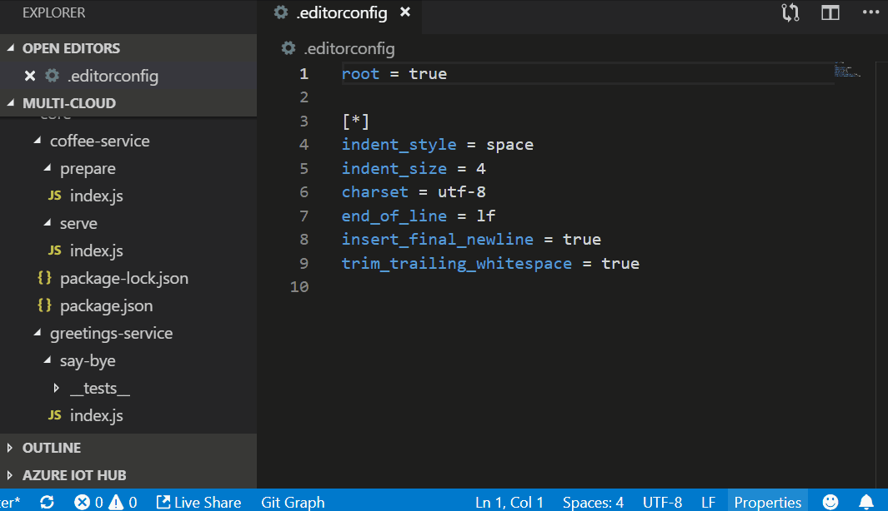

# EditorConfig

EditorConfig helps maintain consistent coding styles for multiple developers working on the same project. EditorConfig consists of a file format for defining coding styles and a collection of text editor plugins that enable editors to read the file format and adhere tgit o defined styles.

## Prerequisites

We use [Visual Studio Code](https://code.visualstudio.com/) for this project and the documentation will be focus on this tool. If you are looking for the configuration for another editor you can look for the information [here](https://editorconfig.org/).

## Installation

To install EditorConfig go to the extensions tab in the Visual Studio Code and look for it in the search engine and install it. Once it is installed, restart Visual Studio Code to apply the changes.

Another option to install it is opening the Quick Open menu (Ctrl+P) and then running the following command: **ext install EditorConfig** , and restart the Vs Code. This wil only open the Extension Marketplace Bar with the EditorConfig already searched.

Without having a Mouse interaction it must be use the command **code --install-extension EditorConfig**


### Verify installation

To verify that EditorConfig was installed correctly, create a .editorconfig file in the root and use the following line of code.

```
root = true
[*]
end_of_line = lf
```

In case of a correct installation all the files that used in the Visual Studio code from the root will change the End Of Line.


## Configuration

The project configuration it us is the next one:

```
root = true
[*]
indent_style = space
indent_size = 2
charset = utf-8
end_of_line = lf
insert_final_newline = true
trim_trailing_whitespace = true
```

### Properties

Brief Description of every property it is use in the project configuration.

-   **indent_style:** Set to `tab` or `space` to use hard tabs or soft tabs respectively.
-   **indent_size:** Set number of of columns used for each indentation level and the width of soft tabs.
-   **charset:** Set to utf8 the caracter set
-   **end_of_line:** Set to `lf`, `cr`, or `crlf` to control how line breaks are represented.
-   **insert_final_newline:** Set to ensure file ends with a newline
-   **trim_trailing_whitespace:** Set to remove any whitespace characters preceding newline characters

> See the complete list of propietes [here](https://github.com/editorconfig/editorconfig/wiki/EditorConfig-Properties)

### Verify configuration

In the lower blue bar button the configuration will change as in the gif below when an update in the .editorconfig file had made.



## Troubleshooting

Git in Windows may present some inconveniences for correct functioning of the EditorConfig. If some files do not present the desired configuration follow the next steps:

### Step 1

Use the following git commands

```
git config core.eol lf
git config core.autocrlf input
```

### Step 2

Go to the local directory and delete all the files and directories inside this folder, except the git configurations.



### Step 3

Finally use the following git command

```
git reset --hard BranchName
```

### Step 4

To check that EditorConfig works correctly, open different files or create a new one and check that the settings are correct, see the gif below.


